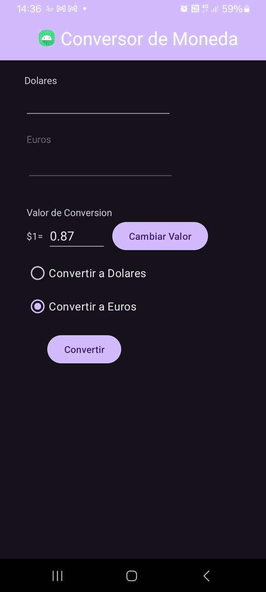

# 💱 Conversor de Moneda USD ↔ EUR (Android + Java + MVVM)

Desarrollamos esta Aplicación móvil en **Android Studio con Java** que permite convertir valores entre **Dólares (USD)** y **Euros (EUR)**, implementando el patrón de arquitectura **MVVM (Model - View - ViewModel)**.

Este proyecto fue realizado como parte de un **Trabajo Práctico de Programación Móvil**, con el objetivo de aplicar una arquitectura limpia, separar responsabilidades entre capas y utilizar **LiveData** para la comunicación entre la lógica y la interfaz.

---

## 📌 Descripción del proyecto

La aplicación permite al usuario:

- Ingresar un monto en **Dólares** o **Euros**.
- Seleccionar el tipo de conversión mediante **RadioButtons**:
  - **Convertir a Dólares**
  - **Convertir a Euros**
- Ejecutar la conversión con el botón **Convertir**.
- Ver el resultado directamente en el campo correspondiente.
- Consultar y modificar la **cotización actual** mediante el botón **Cambiar Valor**.

La lógica de negocio está desacoplada de la interfaz gracias al patrón **MVVM**, lo que permite una mejor organización del código, mayor mantenibilidad y una estructura más cercana a buenas prácticas de desarrollo Android.

---

## 🎯 Objetivos del trabajo práctico

- Aplicar el patrón de arquitectura **MVVM** en una aplicación Android real.
- Separar correctamente la lógica de negocio de la interfaz gráfica.
- Utilizar **LiveData** para comunicar cambios entre capas.
- Manejar eventos del usuario desde la vista y procesarlos en el ViewModel.
- Validar entradas y controlar errores de forma simple y clara.

---

## 🚀 Funcionalidades implementadas

- ✅ Conversión de **USD a EUR**
- ✅ Conversión de **EUR a USD**
- ✅ Selección del tipo de conversión con **RadioButtons**
- ✅ Campo editable para modificar la **cotización**
- ✅ Botón **Convertir**
- ✅ Botón **Cambiar Valor**
- ✅ Visualización del resultado en el campo correspondiente
- ✅ Habilitación dinámica del campo de entrada según la conversión seleccionada
- ✅ Limpieza automática de campos al cambiar el tipo de conversión
- ✅ Validación de valores numéricos
- ✅ Manejo de errores mediante **Toast**

---

🖼️ Interfaz de usuario (XML) y captura de pantalla

Archivo:

app/src/main/res/layout/activity_main.xml

### Vista principal de la aplicación:

<p align="center">
  
</p>

---

## 📂 Estructura real del proyecto

```bash
conversorAndroid-main/
│
├── app/
│   ├── src/
│   │   ├── main/
│   │   │   ├── java/com/desarrolloar/conversor/
│   │   │   │   ├── MainActivity.java
│   │   │   │   ├── MainActivityViewModel.java
│   │   │   │   └── modelo/
│   │   │   │       └── Conversor.java
│   │   │   ├── res/
│   │   │   │   ├── layout/
│   │   │   │   │   └── activity_main.xml
│   │   │   │   ├── values/
│   │   │   │   ├── drawable/
│   │   │   │   ├── mipmap-*/
│   │   │   │   └── xml/
│   │   │   └── AndroidManifest.xml
│   │
│   ├── build.gradle.kts
│   └── proguard-rules.pro
│
├── gradle/
├── build.gradle.kts
├── settings.gradle.kts
└── README.md
```

---

## ⚙️ Cómo ejecutar el proyecto

1. Clonar el repositorio:

```bash
git clone https://github.com/FacuMartinGarcia/conversorAndroid
```

2. Abrir el proyecto en **Android Studio**

3. Esperar a que Android Studio sincronice las dependencias con **Gradle**

4. Ejecutar la app en:

* un **emulador Android**
* o un **dispositivo físico**

---

## 🧪 Validaciones implementadas

Incluimos validaciones :

### En `cambiarCotizacion(...)`

* Verifica que la cotización:

  * no esté vacía
  * sea numérica
  * sea mayor a `0`

Si no cumple:

* muestra el mensaje:

```text
Ingrese una cotización válida
```

### En `convertir(...)`

* Verifica que haya una opción seleccionada
* Verifica que el valor ingresado:

  * no esté vacío
  * sea numérico válido

Mensajes posibles:

* `Seleccioná una opción`
* `Ingrese un valor válido en euros`
* `Ingrese un valor válido en dólares`

### En `parseNumero(...)`

* Acepta tanto **coma** como **punto** decimal:

  * ejemplo: `10,5` o `10.5`
* Esto mejora la usabilidad para diferentes usuarios usuarios  

---

## ✨ Aspectos destacables de la implementación

* Buena separación entre **View**, **ViewModel** y **Model**
* Uso correcto de **LiveData**
* Uso de **ViewBinding** en lugar de `findViewById`
* El `ViewModel` centraliza:

  * estado de la UI
  * validaciones
  * lógica de flujo
* El `Model` se mantiene simple y enfocado en el cálculo

---

## 🔍 Posibles mejoras futuras

Si bien el proyecto cumple bien con la consigna, podriamos aplicar varias mejoras en el futuro:

### 1. Mostrar la cotización de forma más clara

Actualmente se muestra solo el número (`0.87`) en el campo `etCambio`.

**Mejora sugerida:**
Mostrar algo como:

```text
1 USD = 0.87 EUR
```

---

### 2. Mejorar el diseño visual

La interfaz funciona correctamente, pero se podría modernizar con:

* `ConstraintLayout`
* Componentes de **Material Design**
* Mejor espaciado y alineación
* Uso de `TextInputLayout`

---

### 3. Evitar usar `EditText` para mostrar resultados

Actualmente el resultado se escribe en los mismos `EditText`.

**Mejora sugerida:**

* usar un `TextView` para mostrar resultados
* dejar un solo campo editable para el valor de entrada

Esto haría la UX más clara.

---

### 4. Extraer mensajes a `strings.xml`

Los textos como:

* `"Ingrese una cotización válida"`
* `"Cotización actualizada"`
* `"Seleccioná una opción"`

podrían moverse a `strings.xml` para:

* mejor mantenimiento
* soporte futuro para internacionalización

---

## 👨‍💻 Autor / Integrantes

Proyecto desarrollado para la materia **Programación Móvil**.

**Integrantes del grupo:**

* Facundo Martín García
* Victor Angel Aguilera
* Rafael Nicolas Cuello

---

## 📎 Repositorio

Repositorio público del proyecto:

[🔗 conversorAndroid](https://github.com/FacuMartinGarcia/conversorAndroid)

---

## ✅ Conclusión

Este proyecto representa una implementación práctica y correcta de una aplicación Android simple, aplicando el patrón **MVVM** con **Java**, **LiveData** y **ViewBinding**.

Además de resolver la conversión entre monedas, el trabajo nos ayudo a aprnder sobre de organización en capas, separación de responsabilidades y validación de entradas, cumpliendo con los objetivos principales del trabajo asignado.

